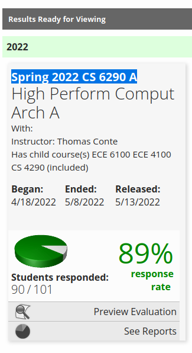

cios progress garbo
===================

how to use
----------

 1. go to <https://mwfoi.smartevals.com/instructor/MyEvalCenter.aspx>
 2. open network tools
 3. refresh page
 4. copy request to <https://mwfoi.smartevals.com/instructor/MyEvalCenter.aspx> as curl
 5. paste in curl.sh
 6. run `./update.sh "Spring 2022 CS 6290 A"`. this string comes from the following text on the page from step \#1 (selected for emphasis):

    

    (also, you should consider running `update.sh` in a [tmux session][1] so
    that it keeps running (updating the counter) when your ssh session dies)
 7. configure your webserver to serve status.txt. for nginx i did

        server {
                listen 443 ssl;
                listen [::]:443 ssl;
                server_name cios.ausb.in;
                location /favicon.ico {
                    root /var/www/cios;
                    try_files /favicon.ico /favicon.ico;
                }
                location / {
                    root /var/www/cios;
                    try_files /status.txt /status.txt;
                }
        }

bibliography
------------

the favicon is due to [some guy named roi][2]

[1]: https://www.redhat.com/sysadmin/introduction-tmux-linux
[2]: https://github.com/ra4king/CircuitSim/blob/6ba0ee8e7631d67dbedf015c27b1bc2dc0ccc78c/release/icon.ico
